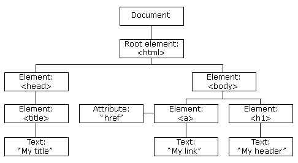

DOM -- Document Object Model
    html tree of objects structures
    

    Document node at the top
    Root element (<html>)
    all other elements branched out (<head> <body> etc.)

    what does javascript DOM APi provides
        convenient methods to manipulate the structure and the content of the HTML document dynamically

        getting single element by id (demo)
            document.getElementById(idName)
    
        multiple elements should iterate over (demo 2)
            document.getElementsByTagName(tagName)
            document.getElementsByClassName(className)

        locating elements based on a query (query selector)
            document.querySelector()
            document.querySelectorALL()

        inserting element (demo 3)
            let newElement = document.createElement(elementName)
                .innerHTML("...")
                    set innerhtml accordingly such as "
new element</[]>"

            get the element of where to insert and append after it
                document.getElementById("id").append(newElement)

                